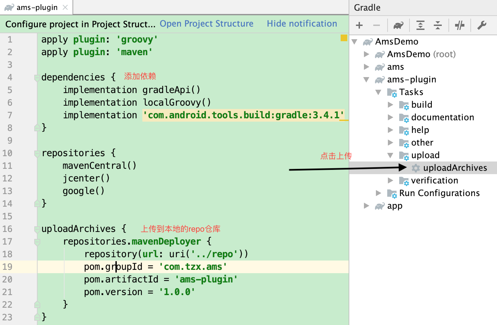
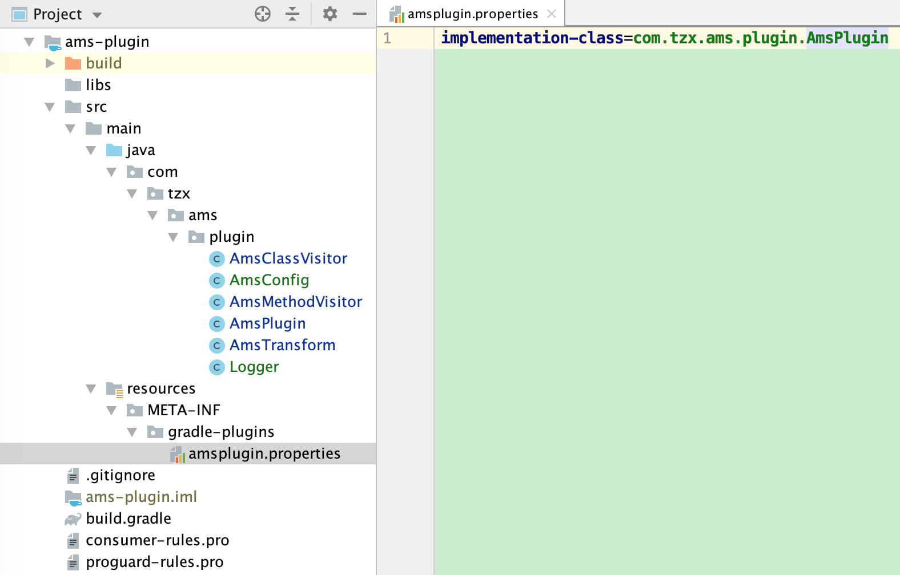

# AndroidPluginStudy

## 自定义plugin开发

`Gradle`从1.5开始，`Gradle`插件包含了一个叫`Transform`的API，这个API允许第三方插件在`class`文件转为为`dex`文件前操作编译好的`class`文件，这个API的目标是简化自定义类操作，而不必处理`Task`，并且在操作上提供更大的灵活性。并且可以更加灵活地进行操作。官方文档：http://google.github.io/android-gradle-dsl/javadoc/

> 类继承`Plugin` 

```java
public class AmsPlugin implements Plugin<Project> {
    @Override
    public void apply(@NonNull Project project) {
        AppExtension appExtension = project.getExtensions().findByType(AppExtension.class);
        assert appExtension != null;
        //注册task任务
        appExtension.registerTransform(new AmsTransform(project));
    }
}
public class AmsTransform extends Transform{
  	/***部分代码省略***/
}
```

> `build.gradle` 文件配置



> 配置`properties`

在 `/src/main/resources/META-INF/gradle-plugins` 目录下创建`xxx.properties` 文件，这个 `xxx` 就是以后项目`build.gradle` 文件中需要`apply` 的插件名称。

```properties
implementation-class=com.tzx.ams.plugin.AmsPlugin
```

`com.tzx.ams.plugin.AmsPlugin` 就是插件对应的类。



> 项目的根 `build.gradle`配置

```groovy
buildscript {
    repositories {
        maven {//添加repo本地仓库
            url uri("repo")
        }
        google()
        jcenter()
    }
    dependencies {
        classpath 'com.android.tools.build:gradle:3.5.3'
        //添加插件依赖
        classpath 'com.tzx.ams:ams-plugin:1.0.0'
    }
}
```

## plugin自定义配置

> 配置类

```java
public class AmsConfig {
    //日志开关
    public boolean isDebug;
    //class包含str则不处理
    public String[] filterContainsClassStr;
    //class以str开头则不处理
    public String[] filterstartsWithClassStr;
    //拦截在这个文件中声明的class
    public String filterClassFile;
    public List<String> filterClassNameList;
    //需要进行注入的method
    public String amsMethodFile;
    //需要进行注入的method对应的tag
    public String amsMethodTag;
    public List<Pair<String, String>> amsMethodFileList;
}
```

> 创建`AmsConfig` 的类对象

```java
public class AmsPlugin implements Plugin<Project> {
    @Override
    public void apply(@NonNull Project project) {
        AppExtension appExtension = project.getExtensions().findByType(AppExtension.class);
        assert appExtension != null;
        //注册优先于task任务的添加
        project.getExtensions().create("AmsConfig", AmsConfig.class);
        appExtension.registerTransform(new AmsTransform(project));
    }
}
```

> `build.gradle` 文件中定义配置（如果gradle中没有定义，那么会反射构造一个对象）

```groovy
apply plugin: 'com.android.application'
apply plugin: 'amsplugin'
AmsConfig{
    isDebug = true
    filterContainsClassStr = ["R.class", ".R\$"]
    filterstartsWithClassStr = ["android"]
    filterClassFile = "amsfilterclass.text"//build.gradle相同目录级别的文件名
    amsMethodFile = "amsmethods.text"//build.gradle相同目录级别的文件名
    amsMethodTag = "TEST"
}
```

> 获取`gradle` 中定义的配置

```java
AmsConfig amsConfig = (AmsConfig) this.project.getExtensions().getByName(AmsConfig.class.getSimpleName());
//配置文件的获取
String projectDri = this.project.getProjectDir().getAbsolutePath()
String fileName = projectDri + File.separatorChar + amsConfig.filterClassFile;
```

这个 `amsConfig` 在使用的时候不用判空，如果调用`project.getExtensions().create` 添加了那么就会反射构造出这个对象。如果`gradle` 文件中定义了，那么这个对象就会被赋与相应的属性值。

如果在获取的时候，没有被`create`那么就会跑出一下异常：

```log
* Where:
Build file '/Users/tanzx/AndroidStudioWorkSpace/GitHub/AmsDemo/app/build.gradle' line: 3
* What went wrong:
A problem occurred evaluating project ':app'.
> Could not find method AmsConfig() for arguments [build_5n6idkxwtmzfflm5k30ynjblo$_run_closure1@2cf1f355] on project ':app' of type org.gradle.api.Project
```

## 日志

`./gradlew build` 的日志

```shell
> Task :app:transformClassesWithAmsTransformForRelease
AmsTransform filterClassName:com.tzx.amsdemo.App.class
AmsTransform filterClassName:com.tzx.amsdemo.BuildConfig.class
AmsTransform amsMethodFile:maintest#com.tzx.amsdemo.MainActivity.class
AmsTransform Find jar input: android.local.jars:AmsTestJar_V1.0.jar:2069720caf021a802230197880600b9eb8ea02c8
AmsTransform Modifyjar: com/tzx/ams_test_jar/AmsTestJar.class
AmsMethodVisitor visitAnnotation Lcom/tzx/ams/TrackMethod;
AmsMethodVisitor TEST  methodName=test
AmsTransform Modifyjar: com/tzx/ams_test_jar/BuildConfig.class
AmsTransform Find jar input: androidx.appcompat:appcompat:1.1.0
AmsTransform Find jar input: androidx.constraintlayout:constraintlayout:1.1.3
AmsTransform Find jar input: androidx.fragment:fragment:1.1.0
AmsTransform Find jar input: androidx.appcompat:appcompat-resources:1.1.0
AmsTransform Find jar input: androidx.drawerlayout:drawerlayout:1.0.0
AmsTransform Find jar input: androidx.viewpager:viewpager:1.0.0
AmsTransform Find jar input: androidx.loader:loader:1.0.0
AmsTransform Find jar input: androidx.activity:activity:1.0.0
AmsTransform Find jar input: androidx.vectordrawable:vectordrawable-animated:1.1.0
AmsTransform Find jar input: androidx.vectordrawable:vectordrawable:1.1.0
AmsTransform Find jar input: androidx.customview:customview:1.0.0
AmsTransform Find jar input: androidx.core:core:1.1.0
AmsTransform Find jar input: androidx.cursoradapter:cursoradapter:1.0.0
AmsTransform Find jar input: androidx.versionedparcelable:versionedparcelable:1.1.0
AmsTransform Find jar input: androidx.collection:collection:1.1.0
AmsTransform Find jar input: androidx.lifecycle:lifecycle-runtime:2.1.0
AmsTransform Find jar input: androidx.lifecycle:lifecycle-viewmodel:2.1.0
AmsTransform Find jar input: androidx.savedstate:savedstate:1.0.0
AmsTransform Find jar input: androidx.interpolator:interpolator:1.0.0
AmsTransform Find jar input: androidx.lifecycle:lifecycle-livedata:2.0.0
AmsTransform Find jar input: androidx.lifecycle:lifecycle-livedata-core:2.0.0
AmsTransform Find jar input: androidx.arch.core:core-runtime:2.0.0
AmsTransform Find jar input: androidx.arch.core:core-common:2.1.0
AmsTransform Find jar input: androidx.lifecycle:lifecycle-common:2.1.0
AmsTransform Find jar input: androidx.annotation:annotation:1.1.0
AmsTransform Find jar input: androidx.constraintlayout:constraintlayout-solver:1.1.3
AmsTransform Find jar input: :ams
AmsTransform Modifyjar: com/tzx/ams/BuildConfig.class
AmsTransform Modifyjar: com/tzx/ams/MethodEventManager.class
AmsTransform Modifyjar: com/tzx/ams/MethodObserver.class
AmsTransform Modifyjar: com/tzx/ams/TrackMethod.class
AmsTransform Find dir input:classes
AmsTransform Modifydir: com.tzx.amsdemo.MainActivity.class
AmsClassVisitor visitMethod: com/tzx/amsdemo/MainActivity TEST methodName= maintest
AmsTransform Modifydir: com.tzx.amsdemo.TimeObserver.class
```

